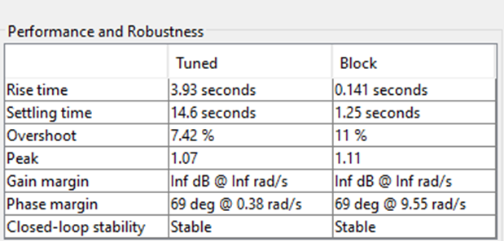

## «DC Motor with Load - Modeling, Control, and Optimization» 

### To control the motor to achieve setpoint, a PID controller was created; this controller was further optimized by a genetic algorithm; later, input disturbances in the form of additional torque were added to the system. The work was done both in Python and Matlab
### Complete simulink model:
### Goals: 
Design a control system for a DC motor driving a mechanical load. The system should be modeled, simulated, and optimized to meet specific performance criteria. The task can be implemented using MATLAB, Python, or any other tool that supports dynamic system modeling (e.g., Simulink or Python’s control library).

### Input data:
DC Motor Parameters: 
– Voltage input: Vin(t) (in volts) \
– Armature resistance: Ra = 2 Ω \
– Armature inductance: La = 0.5 H \
– Motor torque constant: Kt = 0.1 Nm/A \ 
– Back EMF constant: Ke = 0.1 V/rad/s \
– Rotor inertia: Jm = 0.01 kg.m2 \
– Rotor friction coefficient: Bm = 0.001 Nm.s/rad 

### Load: 
The motor is driving an inertial load with inertia JL = 0.02 kg.m2

### Objective: 
The motor should achieve a target angular velocity of 100 rad/s within 2 seconds, with minimal overshoot and steady-state error

 
### System Modeling

Motor dynamics are made of two components: 

    a) Electric dynamics:
 

The rotational movement of the motor in the magnetic field creates an alternating magnetic field, which also creates an inverse emf, which is proportional to the angular velocity.
V_{emf}\ =K_e\cdot\omega\left(t\right)
According to Kirchhoff's rule, the algebraic sum of voltages in any closed circuit is zero.

    b) Mechanical part:
 

According to Newton's law, the sum of torques is equal to the moment of inertia multiplied by the angular acceleration.
J - total moment of inertia, the sum of the moments of inertia of the motor and the load.

### Transfer function:

 

Step function of the transient link and the physical system, they are completely identical

 
### Controller Design

A PID controller was created to control the motor

 
 
 
Also, to limit the initial voltage consumption, a limit of 44 volts was set (the initial values reached thousands of volts, which is not very realistic for a motor of such loads)

 
### Optimization 

To improve the performance, a genetic algorithm was used. The algorithm creates a population of random values for the controller, each of which is evaluated by a value function that dominates

J = dt x sum((Q*(1-y(:)).^2)  + R*u(:).^2)

Where 
1-y is the error value,
U^2 is the input cost
Q,R are the weight parameters for the error and input cost of the motor, respectively.
After that, the lowest-valued coefficients give rise to the next population, their values are crossed and subjected to random mutations. The algorithm has 30 representatives in one generation and is repeated for up to 30 generations.
 

### Results

Complete results are in .docx files